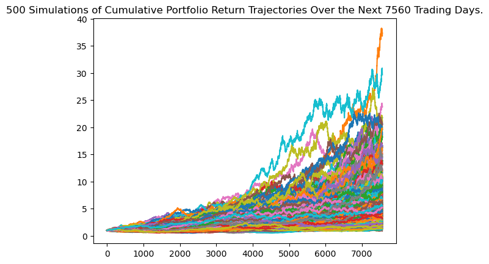
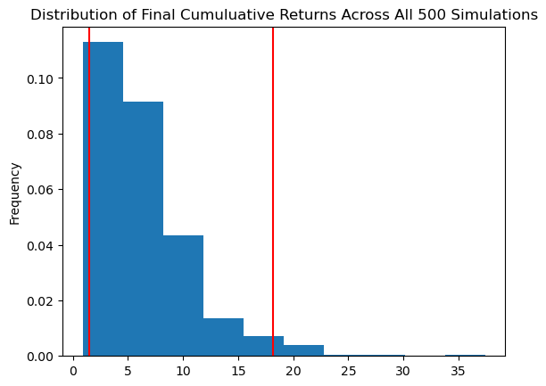
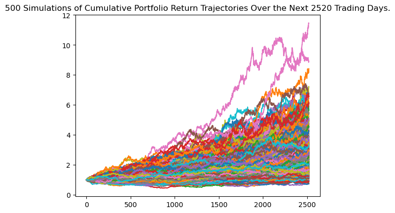
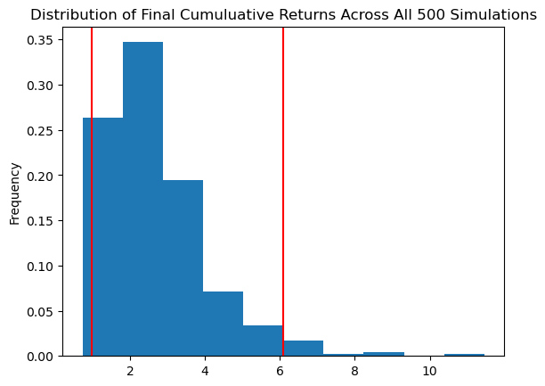

The applicaiton helps evaluate the financial health health of a persons crypto, bonds and stock holds. It helps assess the monthly budgets and second, it forecast a reasonably effective retirement plan based on the current holdings of cryptocurrencies, stocks, and bonds. 

The application accesses the current financial data related to cryptocurrenies, stocks, and bond market using API. The application gets the latest data from API calls to Alpaca and Alternative.me. Application also runs Monte Carlo simulation to analayse the future returns of the portfolio.

---

## Sources

Alpaca - https://github.com/alpacahq/alpaca-py 
Crypto - https://api.alternative.me/

## Output

- The application outputs simulation projected returns and the distributions

#### 30 Year Return - Simulation

#### 30 Year Return - Distribution

#### 10 Year Return - Simulation

#### 10 Year Return - Distribution

---

## Technologies

The program is based on Python 3 and require the following libraries/packages to function

- Alpaca-py (API key is required for Alpaca access. Need to create an account)
- Pandas
- Numpy
- load_dotenv
- Montecarlo Simulations

---

## Installation Guide

The user of the application will have to download Python,   Python package manager PIP and Git.

   - [How to install Python](https://www.python.org/downloads/) 
   - [How to install PIP ](https://pip.pypa.io/en/stable/installation/) 
   - [How to install Git ](https://git-scm.com/book/en/v2/Getting-Started-Installing-Git) 
   
   

---

## Usage

To use the application, follow the steps below.

1. Download the files from Github
    > mkdir portfolio  
    > git clone https://github.com/nafeezurc/cu_fintech_t2_project1 
    > cd portfolio

2.  Create a .env file on the folder for the project and store the alpaca API keys
    > alpaca_api_key={key}  
    > alpaca_secret_key={secret_key}  
   
3. Run the notebook finance_planning_tools.ipynb

---

## Contributors

This application is Mario G.

---

## License

Copyright: N/A
